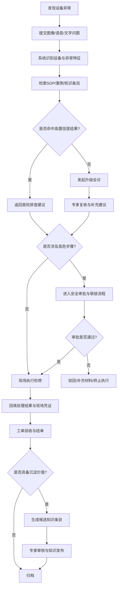

# 检修业务流程与 SOP 文档

## 文档修订记录


| **版本号** | **修订日期** | **修订人** | **修订内容摘要**                                           | **审核人** |
| ---------- | ------------ | ---------- | ---------------------------------------------------------- | ---------- |
| V1.0       | 2026-04-10   | [FXL、LSY] | 初稿创建：定义宏观生命周期、多 Agent 协作流及 SOP 数据规范 | 无         |
| V2.0       | 2026-04-10   | [FXL、LSY] | 基于首期试点范围重构检修流程、状态机与 SOP 数据规范        | 无         |
| V2.1       | 2026-04-11   | [FXL、LSY] | 对齐 A1 赛题：B/S 与目标平台、分级作业引导、模型标注回流；修正 Mermaid 代码块标记 | 无         |

## 1. 文档目的

本文档用于定义“工业多模态检修系统”在首期试点阶段的检修业务流程、工单状态流转、关键审批节点、异常阻断机制与 SOP 结构化规范，为后续产品设计、接口设计、数据库设计与测试验收提供统一依据。

本文档重点回答以下问题：

1. 从发现异常到完成检修，业务流程如何流转；
2. 在每个阶段由谁执行、输入什么、输出什么；
3. 哪些情况必须阻断或升级；
4. 高危步骤如何进入审批与联锁流程；
5. 检修过程如何转化为结构化 SOP 与知识资产。

------

## 2. 适用范围

本文档适用于首期试点范围内的**机泵类设备辅助检修场景**，重点覆盖以下业务：

- 现场异常发现与问题上报；
- 常规故障首轮辅助排查；
- **按设备类型与检修等级的标准化分步作业引导**（与《用户角色与使用场景文档》UC-06 对应）；
- 疑难故障升级会诊；
- 高危步骤审批与安全联锁；
- 检修结果回填与工单结单；
- 经验沉淀与 SOP / 案例更新；
- **模型输出人工纠错与标注回流**（与 UC-07 对应）。

**交付与运行约束（与赛题一致）：** 系统对外以 **B/S** 形态提供能力；**正式验收与竞赛评测**时，服务端须在 **龙芯 LoongArch + 银河麒麟高级服务器操作系统（V10/V11）** 上运行。开发期可在其他架构联调，但状态机、留痕与接口设计须保持跨环境一致。

本文档不覆盖以下内容：

- 设备自动启停或 PLC 指令下发；
- 全厂多设备协同调度；
- 预测性维护完整闭环；
- 数字孪生联动；
- ERP、采购、财务等经营管理流程。

------

## 3. 流程设计原则

本系统的检修业务流程遵循以下原则：

1. **先检索后生成，先依据后建议**；
2. **高危操作先阻断、再审批、后执行**；
3. **系统提供辅助建议，不替代人工责任主体**；
4. **流程必须留痕，关键节点必须可追溯**；
5. **未命中时明确提示，不允许无依据输出**；
6. **知识沉淀必须经过审核，不直接写回正式知识库**。

## 4. 检修业务总流程

首版系统围绕如下主流程运行：

**发现异常 → 上报问题 → 系统识别与检索 → 输出首轮建议 → 判断是否升级/审批 → 执行检修 → 回填结果 → 结单归档 → 知识沉淀**

可用 Mermaid 表示如下：



### 4.1 与 A1 赛题「检索 + 作业」能力的映射

| 赛题能力要点 | 在本流程中的体现 |
| ------------ | ---------------- |
| 多模态 + 设备型号/台账检索 | 子流程 A 的输入与检索步骤；语义与模糊匹配策略见《业务场景定义文档》 |
| 标准化作业引导 | 子流程 A 返回首轮建议后，进入 **分步工步引导**（可与 `S3` 并行在交互层表现，由前端锁定顺序）；检修等级与模板见第 10 节 |
| 高危审批 | 子流程 C；状态 `S6` |
| 知识积累与审核 | 子流程 E；状态 `S11`～`S12` |
| 人工纠正 LLM 输出 | 第 12.5 节；与专家会诊子流程 B 衔接，不替代审批与知识发布 |

------

## 5. 工单状态机定义

为便于后续数据库设计与接口落地，首版系统定义如下工单状态。

| 状态编码 | 状态名称   | 含义说明                           |
| -------- | ---------- | ---------------------------------- |
| S1       | 待受理     | 异常已上报，等待系统识别与检索     |
| S2       | 待首轮建议 | 系统正在处理输入并检索知识         |
| S3       | 待现场确认 | 系统已返回建议，等待现场选择动作   |
| S4       | 待升级会诊 | 当前问题需进入专家复核流程         |
| S5       | 会诊中     | 技术专家正在查看并补充处理意见     |
| S6       | 待安全审批 | 涉及高危步骤，等待安全授权         |
| S7       | 检修中     | 已获得执行条件，现场正在处理       |
| S8       | 待结果回填 | 现场处理完成，等待上传结果与凭证   |
| S9       | 待验收     | 等待专家或责任人复核结论           |
| S10      | 已结单     | 检修流程结束，工单归档             |
| S11      | 待知识沉淀 | 工单被标记为可转知识资产           |
| S12      | 已沉淀归档 | 知识条目已审核发布并完成归档       |
| SX       | 已中止     | 因审批失败、信息不足或人工终止关闭 |

## 6. 状态流转规则

### 6.1 主流转规则

- `S1 -> S2`：用户提交问题成功；
- `S2 -> S3`：系统检索完成并返回首轮建议；
- `S2 -> S4`：系统未命中高置信度结果或主动触发升级；
- `S3 -> S7`：建议可直接执行且不涉及高危步骤；
- `S3 -> S6`：建议包含高危步骤；
- `S4 -> S5`：专家接单开始会诊；
- `S5 -> S7`：专家建议可直接执行且不涉及高危步骤；
- `S5 -> S6`：专家建议涉及高危步骤；
- `S6 -> S7`：审批通过；
- `S6 -> SX`：审批驳回或长时间未补齐材料；
- `S7 -> S8`：现场处理完成；
- `S8 -> S9`：结果与凭证提交成功；
- `S9 -> S10`：复核通过并结单；
- `S10 -> S11`：工单被标记具备知识沉淀价值；
- `S11 -> S12`：知识条目审核发布完成。

### 6.2 回退规则

- 在 `S3` 阶段可返回重新提问；
- 在 `S5` 阶段专家可退回要求补充现场材料；
- 在 `S6` 阶段审批人可退回补充安全凭证；
- 在 `S9` 阶段复核人可退回 `S8` 重新补充结果信息。

### 6.3 中止规则

以下情况允许转入 `SX 已中止`：

- 问题描述严重不足且多次补充失败；
- 高危审批被正式驳回；
- 现场人工确认不再继续执行；
- 设备状态变化，当前工单失效；
- 识别为不在首期业务范围内的问题。

## 7. 角色与流程责任分工

| 流程阶段     | 一线检修工人 | 检修班长/技术专家 | 安全审批人 | 系统管理员/知识管理员 |
| ------------ | ------------ | ----------------- | ---------- | --------------------- |
| 异常上报     | 发起         | 可查看            | 不参与     | 不参与                |
| 首轮检索建议 | 查看/确认    | 可查看            | 不参与     | 不参与                |
| 升级会诊     | 发起/补充    | 处理/复核         | 不参与     | 不参与                |
| 高危步骤审批 | 提交凭证     | 可建议            | 审批       | 不参与                |
| 现场执行     | 执行/反馈    | 指导              | 不执行     | 不参与                |
| 结果回填     | 提交         | 复核              | 不参与     | 不参与                |
| 工单结单     | 查看         | 验收/确认         | 不参与     | 不参与                |
| 知识沉淀     | 不直接处理   | 审核内容          | 不参与     | 发布/版本管理         |

------

## 8. 核心子流程定义

### 8.1 子流程 A：现场异常上报与首轮检索

**目标：**
 让一线人员在发现异常后，快速获得与当前设备和现象相关的 SOP / 案例建议。

**输入：**

- 设备编号或设备识别结果；
- 现场照片；
- 语音或文字描述；
- 可选的部件位置和异常标签。

**处理步骤：**

1. 用户在移动端发起问题；
2. 系统记录设备上下文（含 **设备型号/编号/台账关键字**，可与多模态信息联合约束检索）；
3. 用户确认或选择 **检修等级**（如日常保养、计划定修、抢修；亦可由工单类型默认），用于加载对应 **流程模板**；
4. 系统识别图像、语音和文本中的异常特征；
5. 系统对知识库执行 **语义检索 + 关键词/模糊匹配**，检索 SOP、历史案例和相关知识节点；
6. 系统按相关度与安全约束生成首轮建议；
7. 系统返回建议、出处、**分步工步列表（若模板已绑定）** 与下一步可选动作（继续引导 / 升级 / 审批）。

**输出：**

- 建议摘要；
- 相关 SOP / 案例；
- 引用来源；
- 是否需要升级或审批的判断结果。

**完成条件：**

- 用户拿到首轮可执行或可判断的结果；
- 系统将当前请求写入工单主记录。

------

### 8.2 子流程 B：疑难故障升级会诊

**目标：**
 当首轮检索无法给出高置信度建议时，由专家接管问题并形成更可靠结论。

**触发条件：**

- 未命中高置信度结果；
- 多候选结果冲突明显；
- 用户主动点击升级；
- 问题被识别为复杂、高风险或低频异常。

**输入：**

- 原始问题记录；
- 图片、语音、视频等现场证据；
- 系统首轮建议与候选结果；
- 历史工单或设备记录。

**处理步骤：**

1. 系统创建升级工单；
2. 自动整理问题摘要与上下文；
3. 专家查看现场材料与首轮建议；
4. 专家补充、修订或重新组织处理方案；
5. 系统将复核后的建议回传现场；
6. 如包含高危步骤，则继续转入审批流程。

**输出：**

- 专家复核意见；
- 修订后的处理步骤；
- 是否进入高危审批；
- 会诊结论摘要。

------

### 8.3 子流程 C：高危步骤审批与安全联锁

**目标：**
 确保涉及断电、拆卸、挂牌上锁等高危步骤在执行前完成授权与留痕。

**典型适用场景：**

- 断电操作；
- 拆卸机泵关键部件；
- 涉及安全防护确认的动作；
- 其他被标记为高危等级的步骤。

**输入：**

- 待执行步骤；
- 风险等级；
- 对应 SOP 节点；
- 现场安全凭证；
- 专家意见。

**处理步骤：**

1. 系统识别当前步骤为高危；
2. 阻断现场继续执行；
3. 一线工人补充断电、挂牌、上锁等现场凭证；
4. 安全审批人查看材料；
5. 审批人作出批准、驳回或补充材料决定；
6. 批准后系统解锁后续步骤；
7. 驳回则流程中止或退回补充。

**输出：**

- 审批结论；
- 审批意见；
- 审批时间；
- 审批留痕记录。

**硬性规则：**

- 未审批不得执行；
- 审批必须绑定到具体工单与具体步骤；
- 审批通过不等于免除现场责任。

------

### 8.4 子流程 D：检修执行与结果回填

**目标：**
 让现场执行结果进入系统，形成完整闭环。

**输入：**

- 已批准的执行步骤；
- 现场照片、文字或语音结果；
- 检查结果；
- 是否恢复正常的结论。

**处理步骤：**

1. 现场按要求执行检修；
2. 上传处理后照片或视频；
3. 回填关键结果字段；
4. 标注问题是否解决；
5. 若未解决，可再次触发升级；
6. 若已解决，进入待验收状态。

**输出：**

- 检修结果记录；
- 现场凭证；
- 是否解决；
- 后续建议。

------

### 8.5 子流程 E：工单结单与知识沉淀

**目标：**
 将可复用的检修经验转化为标准化知识资产。

**输入：**

- 完整工单记录；
- 检修过程与结果；
- 专家补充说明；
- 原始建议与最终结论。

**处理步骤：**

1. 专家确认工单已完成；
2. 系统判断是否具备知识沉淀价值；
3. 系统生成候选知识条目；
4. 专家审核内容准确性；
5. 知识管理员进行发布、版本管理与归档；
6. 新条目进入正式知识库。

**输出：**

- 候选知识条目；
- 审核结论；
- 版本号；
- 发布状态。

## 9. 阻断、降级与异常处理规则

### 9.1 置信度阻断

当系统无法给出足够可信的首轮结果时，必须阻断直接执行路径，转入升级会诊。

**触发条件示例：**

- Top-1 结果低于设定阈值；
- 多个候选结果分差过小；
- 结果缺少可用出处。

------

### 9.2 安全阻断

当步骤涉及高危动作时，必须阻断执行并进入审批流。

**触发条件示例：**

- 系统命中高危 SOP 节点；
- 专家补充意见中包含高危动作；
- 现场未提交安全凭证。

------

### 9.3 输入质量降级

当图片、语音质量过差时，系统不直接输出高置信度建议，应提示用户补充信息。

**降级策略：**

- 提示重拍/重录；
- 引导用户补充设备编号；
- 切换到文字输入；
- 允许直接发起升级会诊。

------

### 9.4 断网降级

当网络中断时，系统切换为离线保底模式。

**降级策略：**

- 暂停升级会诊；
- 暂停在线知识检索；
- 允许查阅本地预加载基础 SOP；
- 恢复后自动同步离线记录。

------

### 9.5 知识未命中保护

当知识库中不存在相关条目时，系统必须明确提示未命中，不得自由编造答案。

------

## 10. SOP 节点结构规范

为支持检索、执行、审批与追溯，首版系统中每个 SOP 节点至少包含以下字段。

```
{
  "sop_id": "SOP_PUMP_001",
  "version": "v1.0",
  "status": "published",
  "device_type": "机泵",
  "device_model": "CZ型标准化工泵",
  "maintenance_level": "计划定修",
  "flow_template_id": "FLOW_PUMP_PLAN_001",
  "applicable_component": ["法兰", "密封圈", "轴承"],
  "fault_symptom": ["法兰渗漏", "异响"],
  "hazard_level": "medium",
  "prerequisites": ["确认停机", "佩戴防护装备"],
  "tool_list": ["扳手", "手电", "测温枪"],
  "spare_parts": ["O型密封圈"],
  "execution_steps": [
    {
      "step_no": 1,
      "action": "检查法兰结合面是否存在渗漏痕迹",
      "requires_approval": false
    },
    {
      "step_no": 2,
      "action": "关闭上游阀门并准备拆检",
      "requires_approval": true
    }
  ],
  "verification_standard": "恢复运行后无持续渗漏",
  "safety_warnings": ["未断电不得拆卸"],
  "forbidden_operations": ["带压拆卸"],
  "source_document": "《CZ型机泵大修手册》",
  "source_page_range": "第12-15页",
  "created_by": "专家A",
  "reviewed_by": "专家B",
  "updated_at": "2026-04-10T10:00:00Z"
}
```

------

## 11. SOP 版本与发布规则

### 11.1 版本状态

每个 SOP 节点至少具备以下状态：

- `draft`：草稿；
- `reviewing`：审核中；
- `published`：正式发布；
- `suspended`：暂停推荐；
- `archived`：历史归档。

### 11.2 版本更新规则

- 内容修改后必须生成新版本号；
- 旧版本保留历史记录；
- 正式库只允许存在一个当前有效发布版本；
- 被标记为存疑的节点暂停推荐；
- 回滚操作必须记录操作者、原因与时间。

## 12. 知识纠错与自进化机制

为避免错误知识长期留在库中，系统支持以下闭环。

### 12.1 一线报错

当现场发现 SOP 与真实设备不一致时，允许一线人员提交报错说明和现场证据。

### 12.2 节点熔断

被报错的 SOP 节点可被标记为“待复核”并暂停推荐。

### 12.3 专家修订

技术专家查看证据后修正内容，必要时拆分为不同设备型号或不同部件版本。

### 12.4 发布与通知

修订完成后由知识管理员发布新版本，并通知相关使用角色。

### 12.5 模型输出人工标注与纠错回流

对应赛题「支持人工标注和纠正大模型输出，以持续改进系统」与《用户角色与使用场景文档》UC-07。

**适用对象：** 单次对话或工单中由大模型生成的辅助文本片段（含引用说明、步骤归纳等）。

**基本流程：**

1. 技术专家在会诊、复核或质检中打开「模型输出」面板，对指定片段发起 **纠错/标注**（正例、反例、部分错误、安全提示缺失等类型由产品字段约束）；
2. 系统写入 **标注记录**（绑定工单号、消息 ID、模型版本、知识快照版本、操作者、时间）；
3. 若纠错涉及知识库事实错误：可生成 **候选修订** 并入第 12.2～12.4 节的知识修订闭环；
4. 若启用导出：由知识管理员在脱敏与审批通过后导出 JSON/表格，供 RAG 评测集、提示词迭代或后续微调使用。

**原则：** 标注与纠错记录 **不免除** 现场与审批责任；**不经过审核** 的文本不得自动写回正式知识库。

------

## 13. 流程留痕与审计要求

以下行为必须留痕：

- 问题提交；
- 建议生成；
- 专家会诊；
- 审批动作；
- 结果回填；
- 工单结单；
- 知识发布、回滚与下线；
- **模型输出纠错与标注**（含导出审批记录，若启用）。

每条日志至少记录：

- 工单编号；
- 操作人；
- 操作时间；
- 操作类型；
- 变更前状态；
- 变更后状态；
- 备注信息。

------

## 14. 与后续文档的衔接关系

本文档将直接作为以下文档的输入：

- **MVP 产品需求文档**：拆成功能模块和页面流程；
- **数据字典与数据库设计文档**：落为工单表、状态表、SOP 表、流程模板表、审批表、日志表、模型标注与导出审批表（若启用）；
- **接口文档**：定义创建工单、升级会诊、审批、回填结果、发布知识等接口；
- **验收与测试文档**：围绕状态流转、异常阻断、审批留痕、知识更新进行测试设计。

---

## 15. 文档审查与修订摘要（V2.1）

本次对本文档的审查结论与已落实修订如下：

| 审查项 | 结论 | 已落实修订 |
| ------ | ---- | ---------- |
| 与赛题 B/S、LoongArch + 麒麟硬约束 | 原文未显式写出 | 在第 2 节适用范围增加交付与运行约束说明 |
| 「作业系统」分步引导与检修等级 | 总流程图有执行，缺模板与等级字段 | 第 8.1 步增加检修等级与模板加载；第 10 节 JSON 增加 `maintenance_level`、`flow_template_id` |
| 语义 + 模糊检索 | 未写清 | 第 8.1 检索步骤写明与《业务场景定义文档》一致 |
| 人工纠正 LLM 输出 | 仅有知识修订，缺对模型片段的标注 | 新增第 12.5 节；第 13 节留痕补充 |
| Mermaid 渲染兼容性 | 代码块写为 `Mermaid`，部分渲染器不识别 | 统一为 **`mermaid`** 小写 |
| 状态机与「分步引导」关系 | 引导多在 `S3`/`S7` 交互层，易与状态混淆 | 第 4.1 节说明与 `S3` 的并行关系，避免重复编码状态 |

若后续产品将「工步引导」独立为工单子状态，可在本状态机中扩展子状态或并行子工单，再同步修订第 6 节迁移表。
